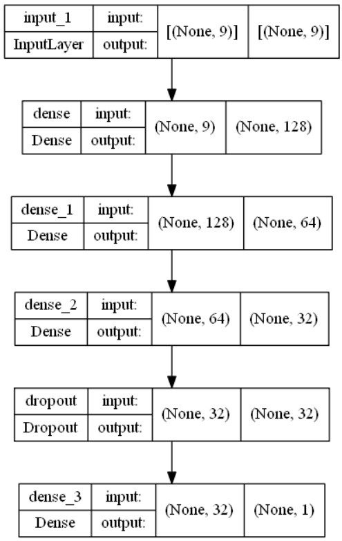
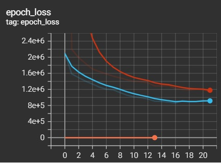
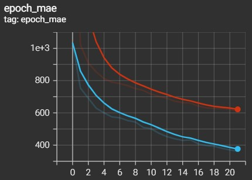
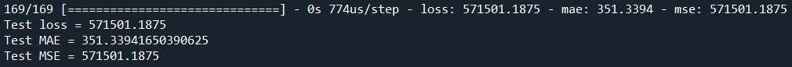
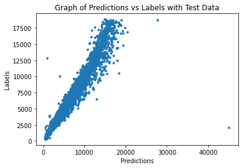

# Diamond Price Prediction Using Feedforward Neural Network
## 1. Summary
To create a Feedforward Neural Network model to predict the price of diamonds, based on the following features:  <br />
&nbsp;&nbsp; i. 4C (cut,clarity,color,carat)
&nbsp;&nbsp; ii. dimensions (x,y,z)
&nbsp;&nbsp; iii. depth
&nbsp;&nbsp; iv. table

## 2. Dataset
The dataset is obtained from [Diamonds dataset](https://www.kaggle.com/datasets/shivam2503/diamonds).

## 3. IDE and Framework
- <b>IDE<b>: Sypder  <br />
- <b>Frameworks<b>: Pandas, Numpy, Scikit-learn and TensorFlow Keras.

## 4. Methodology
### 4.1. Data Pipeline
First, load the data and preprocess the data to remove unuse features. Categorical features are encoded ordinally. Then the data is split into train-validation-test sets, with a ratio of 60:20:20.

### 4.2. Model Pipeline
A feedforward neural network is constructed that is catered for regression problem. <br />
The structure of the model is shown as Figure below.



The model is trained with a batch size of 64 and for 100 epochs. Early stopping is applied in this training. The training stops at epoch 25, with a training MAE of 736 and validation MAE of 535. The two figures below show the graph of the training process, indicating the convergence of model training.

 

## 5. Results
The model are tested with test data. The evaluation result is shown in figure below.



The model is also used to made prediction with test data. A graph of prediction vs label is plotted, as shown in the image below.



Based on the graph, a clear trendline of y=x can be seen, indicating the predictions are fairly similar as labels. However, several outliers can be seen in the graph.

## 6. License
```
MIT License

Copyright (c) [year] [fullname]

Permission is hereby granted, free of charge, to any person obtaining a copy
of this software and associated documentation files (the "Software"), to deal
in the Software without restriction, including without limitation the rights
to use, copy, modify, merge, publish, distribute, sublicense, and/or sell
copies of the Software, and to permit persons to whom the Software is
furnished to do so, subject to the following conditions:

The above copyright notice and this permission notice shall be included in all
copies or substantial portions of the Software.

THE SOFTWARE IS PROVIDED "AS IS", WITHOUT WARRANTY OF ANY KIND, EXPRESS OR
IMPLIED, INCLUDING BUT NOT LIMITED TO THE WARRANTIES OF MERCHANTABILITY,
FITNESS FOR A PARTICULAR PURPOSE AND NONINFRINGEMENT. IN NO EVENT SHALL THE
AUTHORS OR COPYRIGHT HOLDERS BE LIABLE FOR ANY CLAIM, DAMAGES OR OTHER
LIABILITY, WHETHER IN AN ACTION OF CONTRACT, TORT OR OTHERWISE, ARISING FROM,
OUT OF OR IN CONNECTION WITH THE SOFTWARE OR THE USE OR OTHER DEALINGS IN THE
SOFTWARE.
```